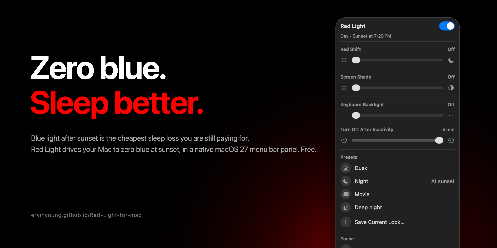

  

# Red Light
Zero blue light after sunset, on your Mac. Blue light after dark is the cheapest sleep loss you are still paying for:
it holds melatonin down and pushes your clock later. Red Light drives the display's blue channel to zero at sunset,
holds deep, true reds through the night, dims the keyboard below the system floor, and hands the day back at sunrise.
A native macOS 27 menu bar panel. Free, open source, on-device, and it learns what you keep choosing.

Site: https://ervinyoung.github.io/Red-Light-for-mac

## The science
Controlled human studies, each linked to its paper:
- **55% less evening melatonin** and a **1.5 h later circadian clock** after reading on a light-emitting screen instead of paper, with reduced next-morning alertness. Chang, Aeschbach, Duffy & Czeisler, [PNAS 2015](https://www.pnas.org/doi/10.1073/pnas.1418490112).
- **99% of people** had a delayed melatonin onset under ordinary room light before bed; melatonin duration shortened by **~90 min**. Gooley et al., [J Clin Endocrinol Metab 2011](https://doi.org/10.1210/jc.2010-2098), n = 116.
- The **blue content** of a display, not its brightness or colour, predicts melatonin suppression and sleep latency; "spectrally tuning the visual display light" is the fix. Schöllhorn et al., [Communications Biology 2023](https://doi.org/10.1038/s42003-023-04598-4), n = 72.
- The retinal cells that set the clock peak near **480 nm**, in a display's blue. Berson, Dunn & Takao, [Science 2002](https://doi.org/10.1126/science.1067262).

Red Light for Mac is not a medical device and makes no medical claims.

## Install
Apple silicon Mac, macOS 26 or later, Xcode Command Line Tools (`xcode-select --install`).

    git clone https://github.com/ervinyoung/Red-Light-for-mac && cd Red-Light-for-mac && ./install.sh

The installer builds the engine and the menu bar app from source, seeds a config, and starts the sunrise/sunset agent.
Everything then lives in `~/Library/Application Support/RedLight`; the menu bar app is `~/Applications/Red Light.app`.
A prebuilt, ad-hoc-signed build is on the Releases page (right-click › Open the first time).

## Terminal
Make a shortcut once:
    echo 'alias redlight="$HOME/Library/Application\ Support/Red Light/redlight"' >> ~/.zshrc && source ~/.zshrc

    redlight status              mode, fade progress, pause, sun times, current settings, location
    redlight suntimes            today's sunrise / sunset and the effective switch times
    redlight night | day         switch now (instant, no fade)
    redlight pause 60            pause for 60 minutes (restores the day look, learns nothing meanwhile)
    redlight pause sunrise       pause until the next sunrise
    redlight resume
    redlight set warmth 80       the unified control, 0–100 or off (see below)
    redlight set keyboard 0.3    keyboard backlight in percent (0.1–30) or off
    redlight set idle 30         keys off after N seconds of inactivity
    redlight set shade 40        screen shade 0–90 or off
    redlight preset list | apply "Night" | save "Reading" book.fill | night "Night" | delete "Reading"
    redlight shade on|off|toggle|up|down|<0-90>
    redlight location 37.43 -122.14 [manual|auto]
    redlight learned | forget
    redlight curve               print the warmth curve
`sunmode` still works as an alias of `redlight`.

## Red Shift: one slider, two mechanisms
Two ways to cut blue light have opposite strengths. Scaling the display's blue and green channels at the
gamma table (what Night Shift and f.lux do) physically removes blue while every pixel keeps its brightness
ordering, so text stays crisp — but it cannot go "beyond zero", and content that lives only in a removed
channel goes dark. Apple's Color Tint filter maps each pixel to its luminance and mixes toward red: nothing
disappears, but hue collapses, and at high intensity everything is the same red blob.

Red Light's Red Shift (`warmth` in the config and CLI) uses each where it is best:
    0–60 %    channel scaling only: blue 100 % → 0, green trimmed to 60 %. Maximum legibility.
    60–100 %  blue stays at zero; green eases to 35 % while a modest luminance-preserving tint (up to 50 %)
              folds the removed green back into red brightness instead of letting it fade to black.
80 % is the default at night. 60 % is the knee: no blue at all, no tint at all.
The gamma legs are drawn by the menu bar app and the tint leg by the engine; `shade.json` carries both.

## Sunset and sunrise
Location comes from the Mac (Location Services, only ever used for sun times, never leaves the machine).
Until permission is granted it is guessed from the time zone; you can also enter coordinates in Settings.
Transitions fade over 30 minutes by default (Settings › Transition; `fadeMinutes` in config.json). Warmth and
shade ease linearly, keyboard brightness logarithmically. If you adjust anything mid-fade, the fade stops and
leaves it where you set it. Waking from sleep triggers an immediate check; a fade that should have happened
while asleep is picked up at the point the clock says it should be.

## Learning
Every minute the engine compares the current settings with what it last saw; a difference is a manual change,
recorded in `events.jsonl`. It never fights a change in the moment. When the value you settle on at night is
about the same on 3 of the last 14 nights it becomes the night default, and when you switch warmth on or off
by hand near a transition on 3 nights, the transition moves (never more than 2 hours). One notification, at
most once a day. `learned.json` holds what it adopted and a dated history; `redlight forget` clears it.

## Files
    config.json      night preset, day defaults, location + source, fade length, learning, presets, shortcuts
    state.json       mode, day snapshot, fade in progress, pause
    learned.json     adopted adjustments and history
    events.jsonl     observed manual changes (pruned past the lookback window)
    shade.json       what the app should draw: shade overlay, warmth, gamma multipliers
    commanded.json   the keyboard brightness last set (the hardware reports 0 once it idle-dims)
    redlight.log    transitions, noticed changes, learned adjustments
    legacy/          the previous SunsetMode install, archived

## Preset ticks
Each slider carries a small mark under the track for every saved preset, at the exact point that preset's
thumb comes to rest. Presets that share a value share one mark.

## The switch and daylight
The switch at the top right is the master switch, and means what the Wi-Fi switch means. Off restores your
normal display straight away and nothing happens at sunset; on follows the sun again and clears any pause.
During the day the controls sit behind glass with "Waiting for sunset" and the time it will start — one tap
clears it if you want to use red light before then.

## Menu bar app
Icon: the sun at the horizon — outline by day, filled at night, a pause badge while paused.
Panel: Warmth · Screen Shade · Keyboard Backlight · Turn Off After Inactivity (sliders snap to detents and
apply live) · Presets (tap to apply; right-click for Use at Sunset / Replace / Delete; + saves the current
look) · Pause · Settings. Global shortcuts: ⌃⌥⌘S toggles the shade, ⌃⌥⌘↑ / ⌃⌥⌘↓ adjust it.
Shade and warmth exist only while the app runs (macOS restores the gamma table when it exits).
Rebuild the engine: `swiftc -O redlight.swift -o redlight`. Rebuild the app: `gui/build.sh`.
Agent: `launchctl bootout gui/$(id -u)/com.ervinyoung.redlight` / `bootstrap gui/$(id -u) ~/Library/LaunchAgents/com.ervinyoung.redlight.plist`
